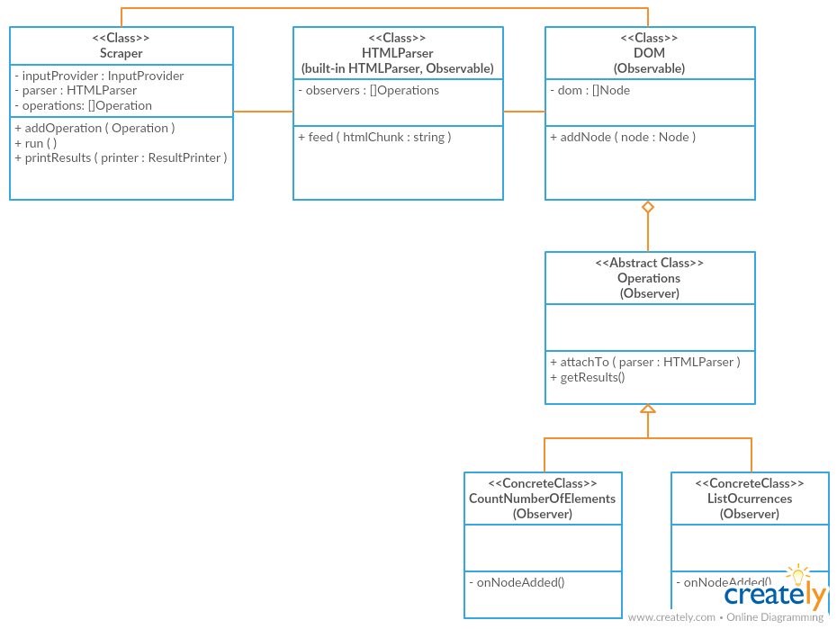

Simple Web Scraper for Python
=============================

Welcome to the more recently rocket technology on Web Scrapers ever. Take a seat and enjoy. Sorry my bad english (and my bad jokes).


# How to run this example:

There is not so much magic. I spend some time trying make a `config.py` file and a more pythonic
way to simplify this step, but I didn't success (and the test is so simple to keep trying).

So, To run the example request:

```
python main_example.py
```

and to run the only one test file that I made (bad for me):
```
cd src/
python -m unittest scraper.test_operations
```

That is all.

# Architecture of this example

I used a OOP design, creating classes and proper abstractions in order to
make the application decoupled and extendable. Some simplifications were
made to avoid make the code too long (I mean, I don't use classes when
the simplicity of the object doesn't deserve it), but I tried to use
design patterns and use loose coupling and high cohesion the best I could.
Each Class has a single purpose on the system, and collaborates with the
other classes to get the simple aim of the test.

This is a class diagram of the main classes:



The Scrapper class is a builder that orchestrates all the process of get useful
data from the desired web page.
It uses a decoupled Reader (is just a function for his simplicity) that takes
html input from somewhere (from an url in this case) and feeds a parser, that
I implemented extending the built-in HTMLParser library.
Then, this parser constructs an internal DOM representation of the page, that
is also provided for the scraper to the parser, and in the process this dom
emits events that are captured for several implementations of the Operation
class (attached to the DOM also by this Scrapper) and used properly to calculate
some analysis on the fly while the DOM is beign constructing.
* Note: My parser implementation was called domBuilder now.

The Scraper was built as a library, that you can use inside your own programs
or write a CLI application that takes orders from the command line.

For this example, I create a `main_example.py` python script on the root that
prepares and use the library to execute only the request that was required in
the test statement.

## Usage
The library exposes a builder class (Scraper) thar receives an URL and a list
of customizable operations to add to the process. This operations are made as
plugins that do analysis  on the flight during the DOM creation (like calculate
the total number of elements of a webpage or the most used n tags).

```python
scraper = Scraper(url)

scraper.addOperation( CountNumberOfElements() )
scraper.addOperation( ListOcurrences( limit=5 ) )
```

Once the scrapper is set up, you could run it in order to actually do the
webpage fetch and the analysis:
```python
scraper.run()
```

Finaly, you could use some of the many scraper-printers available on the Internet to..
just a joke (but you can create it anyway..). I just implemented a ConsolePrinter, that takes
the result of the Scraper operation and prints it nicely on the console.

```python
# Printing results
consolePrinter = ConsolePrinter()
scraper.printResults(consolePrinter)
```

# Assumptions:

In order to limit the scope of the project for the purposes of this example,
some assumptions and limitations were made and are listed below

## 1. Foreign HTML elements are not present
As we can see in the HTML specification here: <http://w3c.github.io/html/syntax.html#void-elements>
there are some HTML elements that don't have a pairing closing tag. This kind of elements
are called Void Elements.
Some of them are part of the HTML specification itself, and are listing in there.
But apart from those, there are others void elements that are part of other specifications
(SVG and MathML spaces, specifically). We'll assume that only regular HTML-space void elements are
present in web pages (and this is true for the web page requested for the test).

## 2. Non-valid DOMs will stop the execution
In the wild web, there are a lot non-w3c compiliant HTML pages and the web browser do
a lot of effort guessing, in order to render pages the more closest they can to the programmer's
intention. This means handle some non-closed tags, sintax errors and things like that.
For our example, we'll not tolerate and handle that. If there is missing tags o sintax
error we will inmediatly stop the excecution indicating that we can't parse the HTML.

## 3. Any Web Page fits in memory
At first I intended to make the fetching-parsing process asynchronyc. My idea was to
put a buffer in the middle of the output of the http-reader and the domBuilder, and even
put each task in his own thread.
This give us two benefits: we don't have to wait for the whole page to be loaded in order
to start parsing and also we fix a bug: we can't trust the whole page fits in system
memory (usually does, of course) and just read all at a glance.
So, because I was having some troubles doing that works (As a begginer python developer I am)
I'll assume that we'll don't have a buffer overflow reading syncronically the webpage, and that
is what I'll do.

## 4. Test covergage is poor.
One of my surprises as a begginer on python programming was the version 2.7 doesn't come charged
with a mock library to use in our unit test. You need to use Python 3 in order to have urllib.mock
library available, o download that dependency (that is not allowed in the test statement).

Because the modeling and coding of this example has taken more time I would wish, I just
include unit test for the operations module, that I think is the core of this application.
(also, as is evident, I didn't use a BDD/TDD approach, I just create the Test Suite after
having code working).

# Final Considerations and conclusion
Apart from the assumptions described above, I tried to make the code the most decoupled I could.
In some parts I decided to do it in a more "hardcore" fashion for the simplicity of the example,
but I tried to explain in comments when that was the case.
Also, I tried to document all classes (less so with methods) and I
did some investigation to refactor some part of the code in a more pythonic way.

Also I left with some unresolved questions like a proper way to place and execute the test
(my test case file is just in the same path where the tested module is stored, and I didn't
find another way to discover/run the test automatically more than just execute manually the file).

As self-critisism, I tried to do this to-much OOP-style and force some patterns in some
places that maybe it adds unnecesary complecity for the purpose of this example.
This takes me a little bit more time refactoring, for a problem that I almost resolve in a
sandbox in 15 min (I left the sandbox file just in case you have curiosity)
Another thing I'm not proud is the algorithm to count the top 5 and the silly way in it is
printed. I would wish to group tags with the same ocurrences but the way in I modeled the
printer or the data structures I choose makes this difficult.
Finally, a better error handler is missing. I left that to do after all the "most important"
things and finally I haven't enough time to make that. I think unit testing is an important
tool also to discover missing error handling of some parts.
